교내에서 열린 대회에 참여하여 AI를 이용한 서비스를 기획/개발중에 있다. 이번 포스팅에서는 프로젝트 초기 세팅(+`PWA`)과 더불어 cloudflare를 이용해 배포하기까지의 과정을 기록할 예정이다.

<!--truncate-->


### 우선 Next 부터 설치

사실 Next 공식문서에 너무 잘 나와있어서 굳~이 글로 쓸 필요는 없을것 같다. 

[Getting Started: Installation](https://nextjs.org/docs/getting-started/installation)

기본 세팅에서는 패키지 매니저가 `npm`으로 되어 있는데 나는 `package-lock.json`을 지우고 `pnpm`으로 설치해줬다. 물론 몇명이서 하는 프로젝트이다 보니 크기가 작아 스펙타클한 효능(?)을 못느끼겠지만 그래도 2~3초 정도 빠르다는 점에서 굳이 안바꿀 이유는 없었다. `yarn`은 업데이트가 안되고 있다고 해서 안쓰려고 하는 중이다.

### cloudflare에 배포

나는 우선 배포부터 하고 보는 스타일이여서 이걸 두번째 단계로 넣었다.

**1. `next.config.js`에 있는 output 추가 (static site로 배포할 경우)**

```jsx
const nextConfig = {
  output: 'export'
}
```

위처럼 코드를 수정한 후 pnpm build를 하면 아래 사진처럼 out 폴더에 정적 html이 생성됨을 확인할 수 있다.

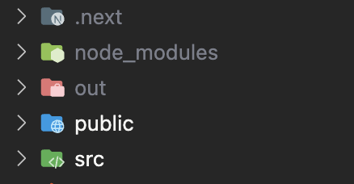

:::tip 원래 예전에는 package.json에서 script도 변경해줬어야 했는데(next build && next export) Next13에서는 변경된듯 하다.
:::

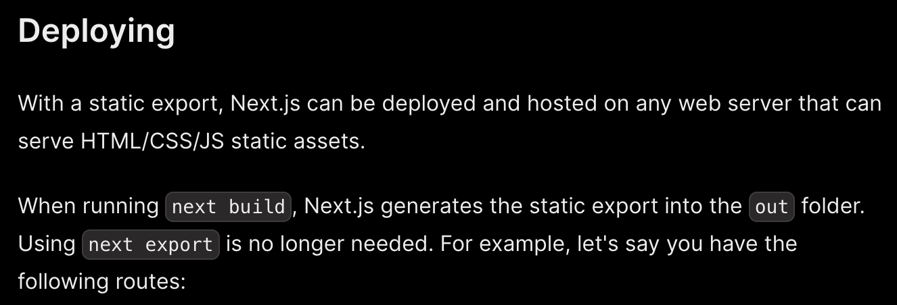

**2. cloudflare 페이지로 이동**

회원가입 & 로그인 후, Workers & Pages 탭을 클릭

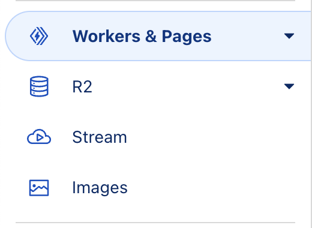

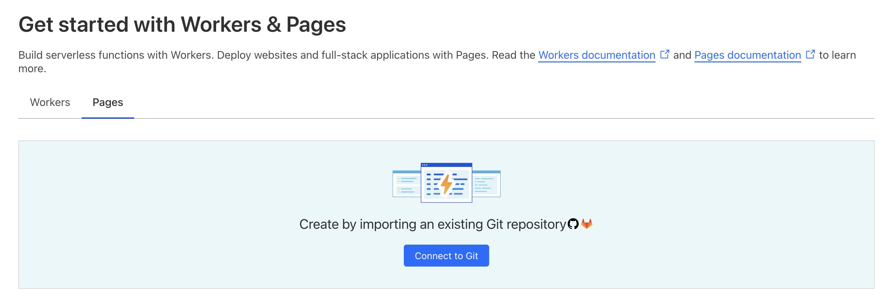

여기에 있는 Pages 탭에서 Connect to Git을 클릭

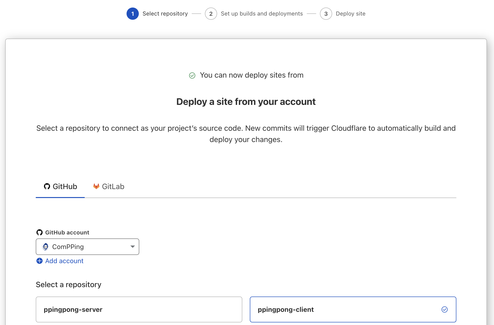

github 연결 해주고 원하는 레포를 선택한다.

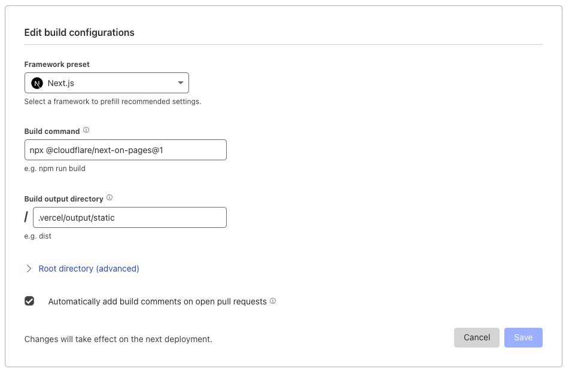

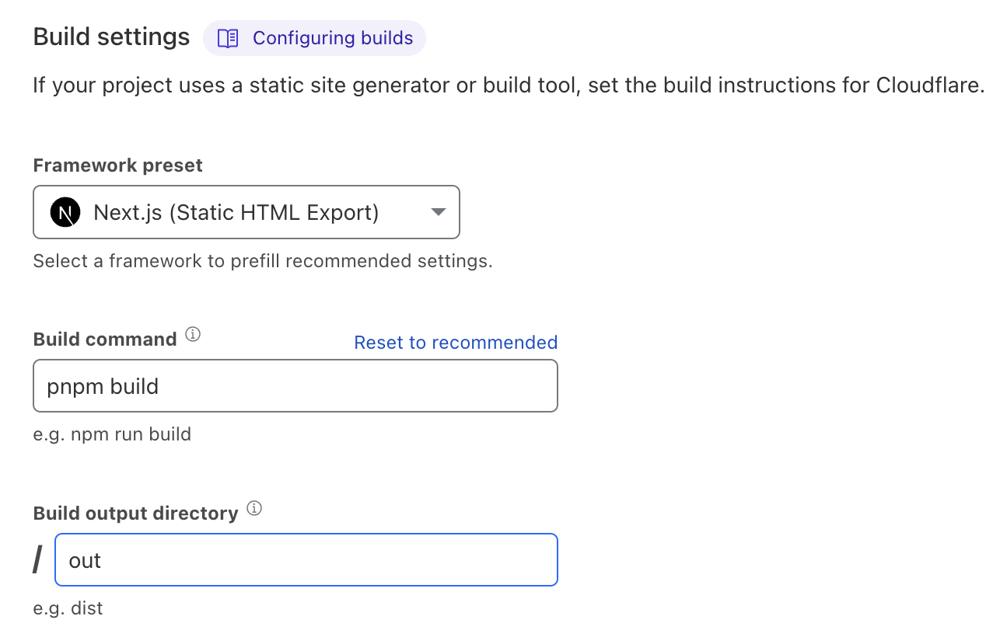

위와 같이 정보를 입려해주면 끝! 아래와 같이 배포가 성공적으로 됐음을 확인할 수 있다.

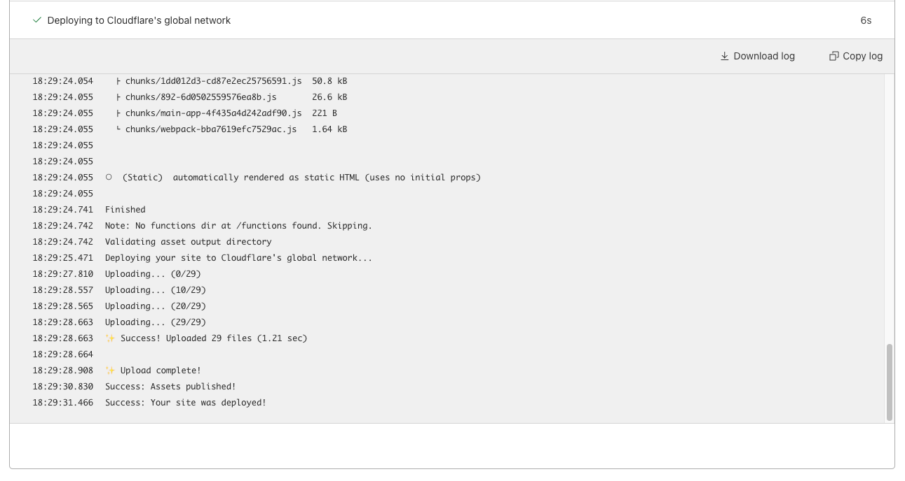

### PWA 적용

우리 서비스는 사용자의 위치를 알고있어야 하기 때문에 PWA 기술을 사용해야한다.  우선 `next-pwa`를 설치해준다.

```bash
pnpm i next-pwa
```

그리고 next.config.js를 아래와 같이 수정한다.

```jsx
const withPWA = require('next-pwa')

const nextConfig = withPWA({
  dest: 'public',
})

module.exports = nextConfig
```

필요한 favicon, icon은 src/app 하위에 넣어주었다.

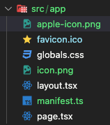

manifest.ts를 아래와 같이 작성해준다.

```jsx
import { MetadataRoute } from 'next'

export default function manifest(): MetadataRoute.Manifest {
  return {
    name: 'ppingpong',
    short_name: 'ppingpong',
    description: 'ppingpong',
    start_url: '/',
    display: 'standalone',
    background_color: '#fff',
    theme_color: '#FD8D32',
    icons: [
      {
        src: '/icon.png',
        sizes: '512x512',
        type: 'image/png',
        purpose: "maskable"
      },
      {
        src: '/apple-icon.png',
        sizes: '512x512',
        type: 'image/png',
      }
    ],
  }
}
```

`gitignore`에 아래와 같은 코드를 추가해주었다.

```bash
public/sw*
public/workbox-*
```

PWA가 제대로 설치되었다면 lighthouse 검사를 통해 아래와 같이 PWA에 초록색이 띄는걸 확인할 수 있다!

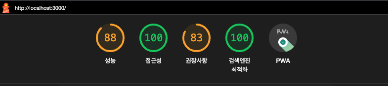

또한 앱을 설치하면 위 사진처럼 크롬앱에서도 확인이 가능하다.

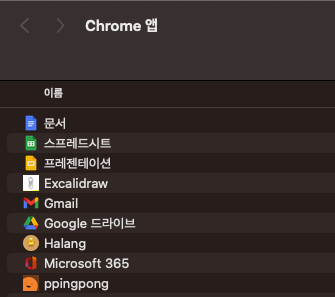

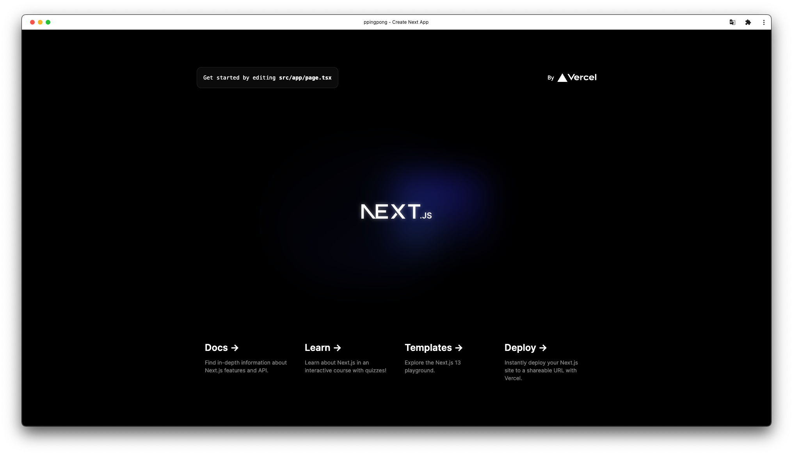

*앱으로 열었을 때 모습*

### 참고자료
[Next.js 공식문서](https://nextjs.org/docs/app/api-reference/file-conventions/metadata)